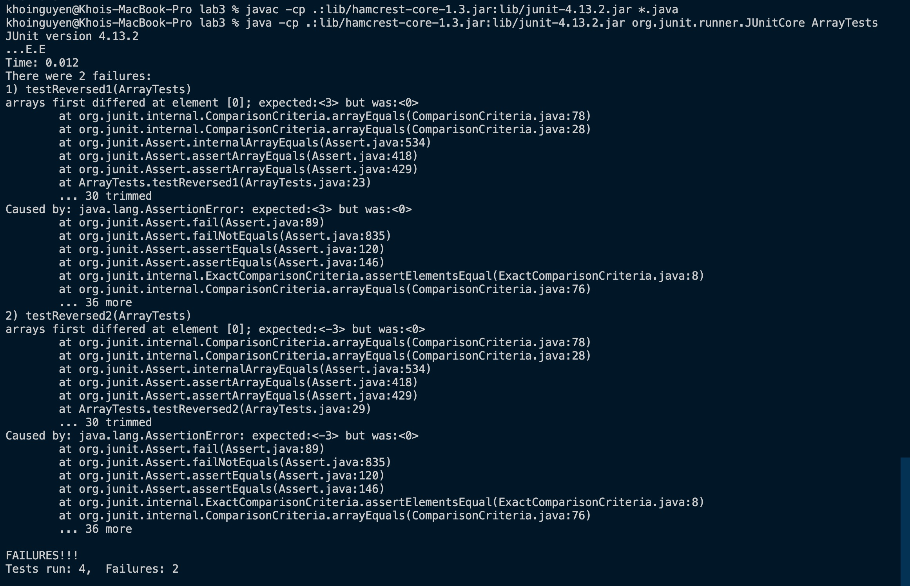
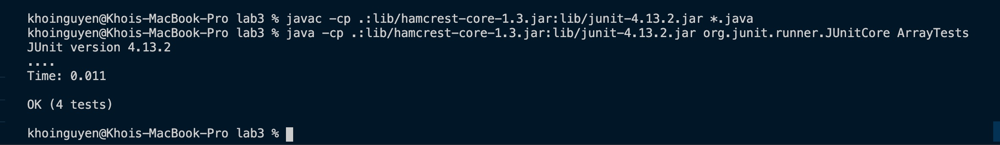

# CSE15L LAB2
## PART 1
In part 1, I will be writing a web server called StringServer that supports the path and behavior described below. It should keep track of a single string that gets added to by incoming requests. <br>
<br>
*The following codeblock details the blocks of code written in StringServer.java* <br>
```ruby
import java.io.IOException;
import java.net.URI;

class Handler implements URLHandler {
    String print = "";

    public String handleRequest(URI url) {
        if (url.getPath().equals("/")) {
            return String.format(print);
        } else if (url.getPath().equals("/add-message")) {
            System.out.println("Path: " + url.getPath());

            String[] parameters = url.getQuery().split("=");
            if (parameters[0].equals("s")) {
                String str = parameters[1];
                print = print + str + "\n";
                return print;
            }
        }
        return "404 Not Found!";
    }
}

class StringServer {
    public static void main(String[] args) throws IOException {
        if(args.length == 0){
            System.out.println("Missing port number! Try any number between 1024 to 49151");
            return;
        }

        int port = Integer.parseInt(args[0]);

        Server.start(port, new Handler());
    }
}
```
*The following images details the server outputs:* <br>
<br>
It is important to note that the main method starts the server. This server is where all of our paths and behaviors will be supported on.
<br>
**1. After `/add-message`**<br>
*Which methods in your code are called?*<br>
The relevant method that is called to get this output is the `handleRequest` method.<br>
<br>
*What are the relevant arguments to those methods, and the values of any relevant fields of the class?*<br>
Revelvant arguments to this method, and the values of any relevant fields of the class includes `add-message` of the pathway, additionally the `=s` in the query, our print value (what will be printed, in this case our value is "Nicki Minaj", and our URL.<br>
<br>
*How do the values of any relevant fields of the class change from this specific request? If no values got changed, explain why.*<br>
The value of printed value changes.  


 <br>
**2. After second `/add-message` , the effect of this request is to concatenate a new line (\n) and the string after = to the running string, and then respond with the entire string so far.**<br>
*Which methods in your code are called?*<br>
The relevant method that is called to get this output is the `handleRequest` method.<br>
<br>
*What are the relevant arguments to those methods, and the values of any relevant fields of the class?* <br>
Revelvant arguments to this method, and the values of any relevant fields of the class includes `add-message` of the pathway, additionally the "s" in the query, our print value (what will be printed, in this case our value is "Nicki Minaj", and our URL.<br>
<br>
*How do the values of any relevant fields of the class change from this specific request? If no values got changed, explain why.*<br>
The value of printed value changes. The url's is pass through the if-statements where the `add-message` path and the `=s` query is identified. From there the string is updated and printed with a new line.

## Part 2
1. A failure-inducing input for the buggy program I implemented was:<br>
```ruby
  //two added tests
@Test
public void testReversed1() {
  int[] input1 = {1,1,1};
  assertArrayEquals(new int[]{1,1,1}, ArrayExamples.reversed(input1));
}
```
<br>
Here our first `int` array has the elements of `{1,1,1}` with the expected output to be `{1,1,1}`.<br>
<br>
2. An input that doesn't induce a failure, as a JUnit test and any associated code is:
```ruby
@Test
public void testReversed2() {
  int[] input2 = {2,4,6};
  assertArrayEquals(new int[]{6,4,2}, ArrayExamples.reversed(input2));
}
```
<br>
3. The sympton, as the output of running the tests was 0 when expected was 1.<br>
4. The bug, as the before-and-after code change required to fix it.<br>
*Before* <br>
<br>
*After* <br>
<br>
<br>

## Part 3
In this lab, I learned how to identify symptoms. I also learned the interworkings of servers and how to create a web server of my own. This includes writing pathways to the URL.
